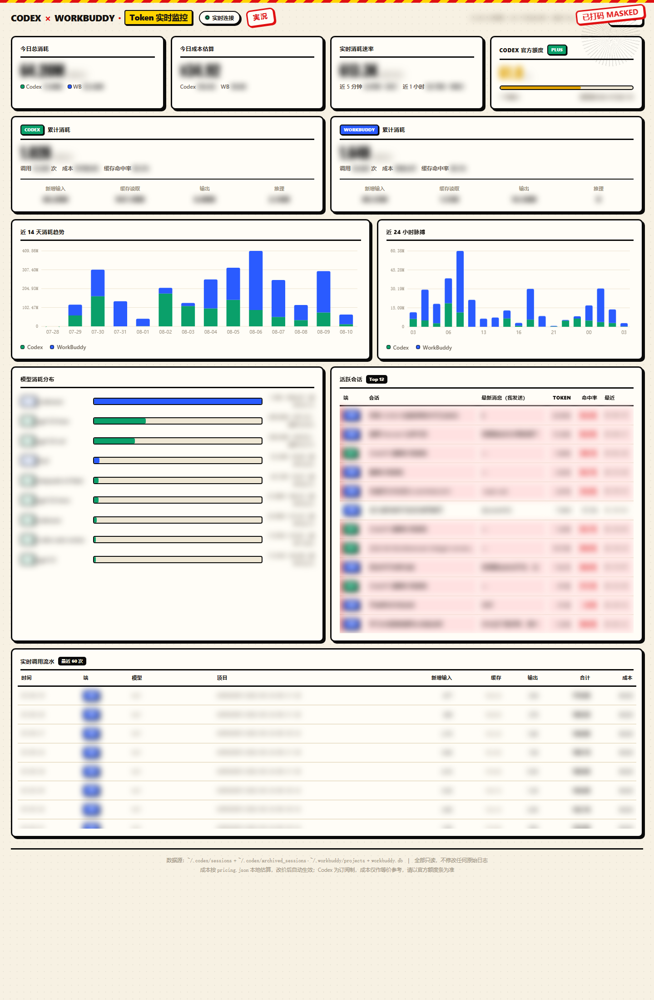

# CODEX × WORKBUDDY Token 实时监控（对话 Token 消耗，命中率）

本地零依赖的 Token 消耗实时监控看板，同时覆盖 **CODEX** 与 **WORKBUDDY** 双端。

> **无需安装：** 把仓库所有文件下载下来，直接双击 `run.bat` 即可运行，不需要 `pip install`、也不需要配置任何环境。

> **只想要 CODEX 监控？** 复制本仓库后让 AI 去掉 WORKBUDDY 相关部分即可（主要涉及 `collector.py` 中的 WorkBuddy 扫描逻辑与 `web/index.html` 里的 WorkBuddy 卡片/图表）。

## 效果预览



## 功能

- 增量扫描本地会话日志，统计 Token 消耗（输入/输出/Cache 写入与读取命中）
- 双端数据源：
  - **CODEX**：`~/.codex/sessions` + `archived_sessions`
  - **WORKBUDDY**：`~/.workbuddy/projects/*.jsonl` + `workbuddy.db`
- 原生 Canvas 看板（无前端框架），支持 SSE 实时自动刷新 + 手动刷新
- 「开始 / 停止（暂停）」按钮：停止仅暂停扫描线程，进程保留，可随时恢复
- 数据展示：总量、活跃会话、单条命中率、双端占比

## 运行

### 方式一：双击启动器（推荐）

双击 `run.bat`：

1. 自动释放 `127.0.0.1:8910` 残留端口
2. 前台启动服务（窗口常驻，报错不会闪退）
3. 用系统默认浏览器打开 `http://127.0.0.1:8910/`

关闭该窗口即停止监控。

> **重启电脑后：** 监控不会自启，双击 `run.bat` 一次即可重新拉起服务并打开看板。

### 方式二：命令行

```bash
python server.py --port 8910 --interval 3
```

打开浏览器访问 `http://127.0.0.1:8910/`。

## 控制接口

| 接口 | 方法 | 说明 |
|---|---|---|
| `/api/summary` | GET | 当前全量统计快照（含 `paused` 字段） |
| `/api/pause` | GET/POST | 暂停扫描（数据停止刷新） |
| `/api/resume` | GET/POST | 恢复扫描 |
| `/api/shutdown` | GET/POST | 关闭服务 |

## 文件结构

```
server.py           HTTP/SSE 服务 + 控制接口
extras.py          活跃会话最新消息抓取（≤10 字）
collector.py        双端日志扫描 + 统计聚合
pricing.json        模型定价表
web/index.html      看板前端（Canvas + SSE）
run.bat         一键启动器
assets/dashboard-v5-running-blurred.png 看板截图
.gitignore          排除 monitor.db / .scan-state.json / __pycache__ 等本地状态
```

## 隐私说明

`.gitignore` 已排除以下本地数据，**绝不会入库**：

- `monitor.db`、`.scan-state.json`：本地解析出的真实 Token 消耗明细与扫描状态
- `__pycache__/`：编译产物
- `01-*执行报告*.json`：含个人聚合数据的交付报告

## 环境要求

- Python 3.10+（仅用标准库，无需 `pip install`）
- Windows（启动器为 `.bat`；macOS/Linux 可直接用命令行方式运行）

---

# English

> **对话 Token 消耗，命中率** · Conversation Token Usage & Cache-Hit Rate

A local, zero-dependency real-time Token usage monitoring dashboard that covers both **CODEX** and **WORKBUDDY**.

> **No installation required:** Download all repository files and double-click `run.bat` to run. No `pip install`, no environment setup.

> **CODEX-only?** After cloning the repo, ask an AI to remove the WORKBUDDY parts (mainly the WorkBuddy scanning logic in `collector.py` and the WorkBuddy cards/charts in `web/index.html`).

## Features

- Incremental scan of local session logs to track Token consumption (input / output / cache write & read hits)
- Dual data sources:
  - **CODEX**: `~/.codex/sessions` + `archived_sessions`
  - **WORKBUDDY**: `~/.workbuddy/projects/*.jsonl` + `workbuddy.db`
- Native Canvas dashboard (no frontend framework), with SSE live auto-refresh + manual refresh
- **Start / Stop (pause)** buttons: stopping only pauses the scan thread while the process stays alive, so it can resume anytime
- Data shown: totals, active sessions, per-call cache-hit rate, and dual-end breakdown

## How to Run

### Option 1: Double-click the launcher (recommended)

Double-click `run.bat`:

1. Automatically frees the `127.0.0.1:8910` port if occupied
2. Starts the server in the foreground (window stays open; errors won't crash it)
3. Opens `http://127.0.0.1:8910/` in your default browser

Closing that window stops the monitoring.

> **After a reboot:** the monitor does not auto-start. Just double-click `run.bat` once to bring the service and dashboard back up.

### Option 2: Command line

```bash
python server.py --port 8910 --interval 3
```

Then open `http://127.0.0.1:8910/` in your browser.

## Control API

| Endpoint | Method | Description |
|---|---|---|
| `/api/summary` | GET | Full snapshot (includes the `paused` field) |
| `/api/pause` | GET/POST | Pause scanning (data stops refreshing) |
| `/api/resume` | GET/POST | Resume scanning |
| `/api/shutdown` | GET/POST | Shut down the service |

## Requirements

- Python 3.10+ (standard library only, no `pip install`)
- Windows (launcher is a `.bat`; macOS/Linux can run via the command line)
